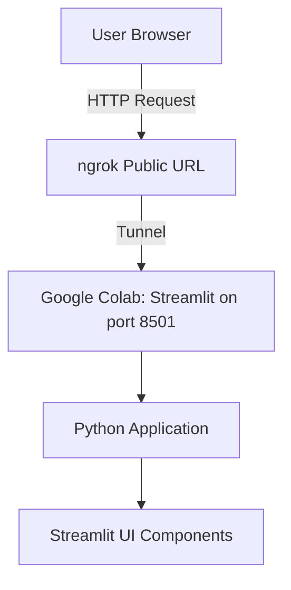

# ngrok: Running Streamlit Apps on Google Colab with ngrok

## Table of Contents
1. [Project Overview](#project-overview)
2. [System Architecture](#system-architecture)
3. [Setup Instructions](#setup-instructions)
4. [Workflow Explanation](#workflow-explanation)
5. [Troubleshooting](#troubleshooting)
6. [Security Considerations](#security-considerations)
7. [Limitations](#limitations)

## Project Overview

This project demonstrates how to create and deploy a Streamlit web application directly from Google Colab using ngrok for public access. The solution provides a quick way to prototype and share data applications without requiring local development environments or cloud hosting services.

Key Components:
- **Google Colab**: Cloud-based Jupyter notebook environment
- **Streamlit**: Python framework for building web apps
- **ngrok**: Secure tunnel to localhost for public access
- **pyngrok**: Python wrapper for ngrok

## System Architecture



## Setup Instructions

### Prerequisites
1. Google account (for Colab access)
2. Free ngrok account (for authentication token)

### Step-by-Step Implementation

1. **Create a new Colab notebook**
   - Go to [Google Colab](https://colab.research.google.com/)
   - Click "New Notebook"

2. **Install required packages**
   ```python
   !pip install streamlit pyngrok -q
   ```

3. **Create the Streamlit app file**
   ```python
   %%writefile app.py
   import streamlit as st
   import pandas as pd
   
   st.set_page_config(page_title="Colab App", layout="wide")
   st.title("My First Streamlit Web App")
   # ... rest of your Streamlit code ...
   ```

4. **Configure ngrok and run the app**
   ```python
   from pyngrok import ngrok
   import threading
   import time
   import subprocess
   
   # Set your ngrok authtoken
   ngrok.set_auth_token("YOUR_NGROK_AUTHTOKEN_HERE")
   
   # Function to run Streamlit in background
   def run_streamlit():
       subprocess.Popen(["streamlit", "run", "app.py", "--server.port", "8501", "--server.headless", "true"])
   
   # Start Streamlit in a thread
   threading.Thread(target=run_streamlit).start()
   time.sleep(5)
   
   # Create ngrok tunnel
   public_url = ngrok.connect(8501)
   print("Public URL:", public_url)
   ```

## Workflow Explanation

1. **Initialization Phase**
   - Packages are installed in the Colab environment
   - Streamlit app file (`app.py`) is created
   - ngrok is authenticated using your token

2. **Execution Phase**
   - Streamlit server starts on port 8501 in headless mode
   - ngrok creates a secure tunnel to this port
   - Public URL is generated and displayed

3. **Access Phase**
   - Users can access the app via the ngrok URL
   - All interactions are tunneled through ngrok to Colab
   - Session remains active as long as the Colab notebook is running

## Troubleshooting

| Issue | Solution |
|-------|----------|
| ngrok authentication failed | Verify your auth token at https://dashboard.ngrok.com/get-started/your-authtoken |
| Streamlit not starting | Check Colab runtime (Menu > Runtime > Restart runtime) |
| Connection timeouts | Ensure Colab notebook is active (sessions time out after inactivity) |
| Port already in use | Change port number in both Streamlit and ngrok commands |
| "Module not found" errors | Re-run the pip install commands |

## Security Considerations

1. **ngrok Security**
   - Free ngrok URLs are public and temporary
   - Consider password protection for sensitive applications
   - Upgrade to ngrok paid plan for reserved domains and more security options

2. **Colab Limitations**
   - Sessions terminate after 12 hours of inactivity
   - No persistent storage between sessions
   - Public URLs expose your app to anyone with the link

3. **Best Practices**
   - Don't include sensitive data in your Colab notebook
   - Use environment variables for secrets (though limited in Colab)
   - Consider adding authentication to your Streamlit app

## Limitations

1. **Session Duration**
   - Colab sessions automatically disconnect after 90 minutes of inactivity
   - Maximum continuous runtime is 12 hours (for free tier)

2. **Performance**
   - Colab provides limited CPU/RAM resources
   - Not suitable for high-traffic applications

3. **Persistence**
   - All changes are lost when the session ends
   - Need to re-run all cells to restart the app

4. **ngrok Free Tier**
   - Random URLs change each time
   - Limited concurrent connections
   - Bandwidth restrictions

## Conclusion

This solution provides a quick way to prototype and share Streamlit applications directly from Google Colab, leveraging ngrok for public access. While not suitable for production workloads, it offers an excellent zero-setup environment for demonstrations, quick prototypes, and educational purposes.

For more permanent solutions, consider migrating to dedicated hosting platforms like Streamlit Community Cloud or traditional cloud providers once your application matures.


## Author Info

* **Email:** [iconicemon01@gmail.com](mailto:iconicemon01@gmail.com)
* **WhatsApp:** [+8801834363533](https://wa.me/8801834363533)
* **GitHub:** [Md-Emon-Hasan](https://github.com/Md-Emon-Hasan)
* **LinkedIn:** [Md Emon Hasan](https://www.linkedin.com/in/md-emon-hasan-695483237/)
* **Facebook:** [Md Emon Hasan](https://www.facebook.com/mdemon.hasan2001/)
